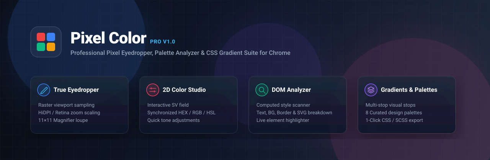
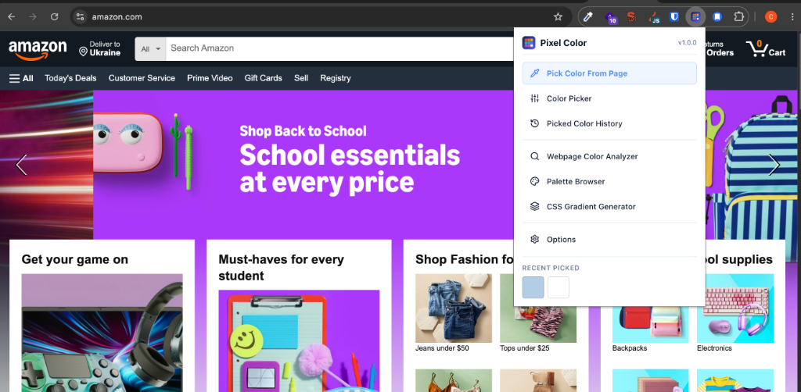
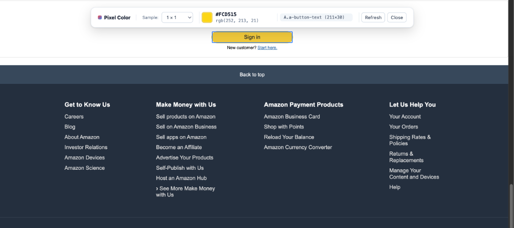
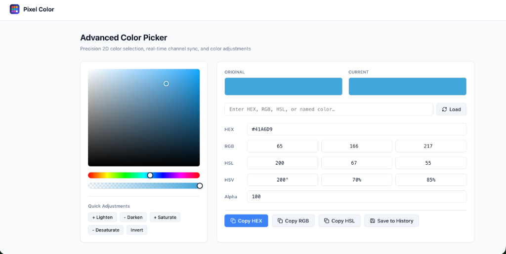
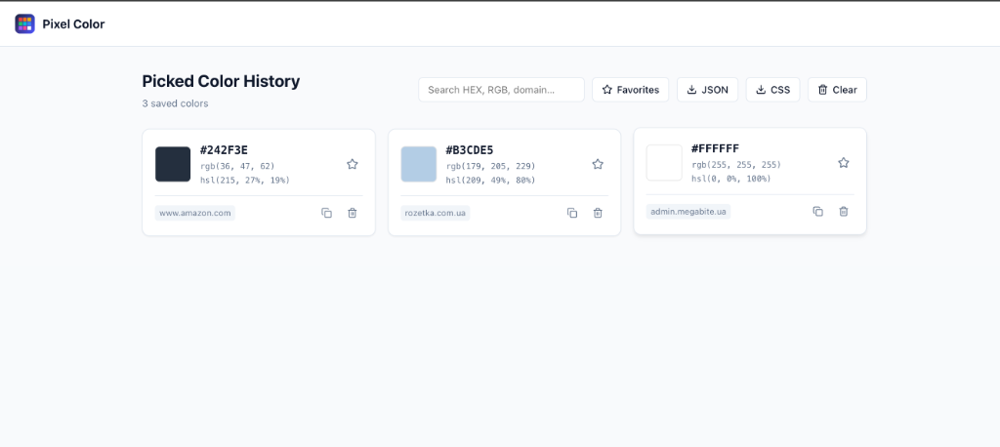
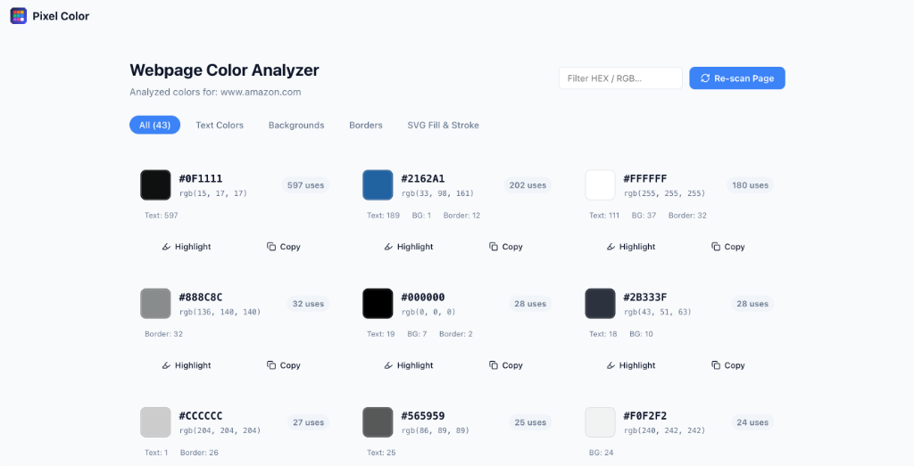

# Pixel Color — Professional Eyedropper, Palette Analyzer & Gradient Studio

<div align="center">

[](https://chrome.google.com/webstore)
[](https://developer.chrome.com/docs/extensions/mv3/intro/)
[](https://react.dev/)
[](https://vitejs.dev/)
[](tests/unit/)
[](LICENSE)
[](#-privacy--security)

---

### Fast, lightweight, and 100% private in-browser Chrome extension for pixel-accurate color picking, live DOM palette analysis, advanced color model conversions, and modern pure CSS gradient generation.

</div>

<br />

<p align="center">
  
</p>

<br />

---

## 📸 Visual Walkthrough & Screenshots

### 1. Quick Access Popup

Fast one-click launcher for all color tools with an instant recent colors swatch strip and 1-click clipboard copy.

<p align="center">
  
</p>

---

### 2. True Raster Eyedropper on Live Webpages

Pixel-perfect sampling of actual rendered viewport pixels with dynamic HiDPI/Retina scaling, multi-pixel sampling ($1\times1$ to $25\times25$), and real-time DOM element inspection.

<p align="center">
  
</p>

---

### 3. Advanced 2D Color Picker Studio

Interactive 2D Saturation-Value canvas, Hue & Alpha sliders, real-time bidirectional synchronization across HEX, RGB, HSL, HSV, and one-click color tone modifiers (Lighten, Darken, Saturate, Desaturate, Invert).

<p align="center">
  
</p>

---

### 4. Picked Color History & Multi-Format Export

Persistent local history with search, favorite tagging, domain attribution, and one-click export to JSON, CSV, or CSS custom properties.

<p align="center">
  
</p>

---

### 5. Webpage Color Analyzer & Live Element Highlighter

Deep DOM computed style scanner aggregating all page colors into usage categories (Text, Background, Borders, SVG) with interactive live element highlighting directly on the webpage.

<p align="center">
  
</p>

---

## 🚀 Key Highlights & Capabilities

- 🎯 **True Raster Pixel Sampling**: Samples actual visual colors from rendered screenshots rather than merely reading CSS `background-color`. Works seamlessly across images, WebGL canvases, SVG vectors, video frames, CSS gradients, and layered alpha-transparent elements.
- 📐 **Retina / HiDPI & Zoom Resilient**: Dynamically calculates coordinate scaling ($\text{scaleX} = \text{width} / \text{innerWidth}$) to guarantee pixel precision regardless of OS DPI scaling or browser zoom level.
- 🔍 **Precision 11×11 Magnifier Loupe**: Floating 220×220px zoom loupe with crisp pixel grid, target crosshair, dynamic edge-flipping, and zero pointer interference.
- 🔬 **Adjustable Sampling Areas & Modes**: Select $1\times1$, $3\times3$, $5\times5$, $11\times11$, or $25\times25$ sample boxes with **Average Color** or **Center Pixel** math.
- 🏷️ **Real-Time DOM Element Inspector**: Identifies hovered DOM elements, extracting Tag name, ID, Classes, and computed dimensions (`rect.width × rect.height`) with non-intrusive outline highlights.
- 🛡️ **Shadow DOM UI Isolation**: The eyedropper toolbar, magnifier, and toast alerts live inside `#pixel-color-root` with an open shadow root, protecting them from host page CSS resets and style pollution.
- 🔄 **Safe Scroll & Resize Recapturing**: Debounced screenshot recapturing that automatically hides the overlay UI before capture to prevent self-sampling artifacts.
- 🎨 **Webpage Color Analyzer**: Scans up to 3,000 DOM nodes for computed text, background, border, and SVG colors, grouping them by frequency and providing on-page live highlighting.
- 🌈 **CSS Gradient Studio**: Visual multi-stop gradient editor supporting Linear (custom angles, angle presets) and Radial (shape & position) modes with clean vendor-prefix-free pure CSS export.
- 📚 **Curated Palette Browser**: 8 original designer palettes (Nordic Pastel, Cyberpunk Neon, Ocean Deep, etc.) with automatic CSS color name resolution and WCAG contrast ratio calculations.
- 🔒 **100% Privacy-First Architecture**: Operates completely client-side in your browser. Zero backend servers, zero telemetry, zero analytics, and memory-only screenshot handling.

---

## 📂 Feature & Tool Matrix

| Tool / Module              | Core Functionality                                                                | Supported Formats / Outputs                              |
| :------------------------- | :-------------------------------------------------------------------------------- | :------------------------------------------------------- |
| **Pick Color From Page**   | Viewport raster sampling, 11×11 loupe, DOM element badge, scroll recapture        | HEX (Upper/Lower), HEX8, RGB, RGBA, HSL, HSLA, HSV       |
| **Color Picker Studio**    | 2D SV canvas, 1D Hue & Alpha sliders, Quick Adjustments, Parser                   | HEX, RGB, HSL, HSV, Alpha %                              |
| **Color History**          | Local persistent storage (`chrome.storage.local`), favorites, domain tracking     | JSON, CSV, CSS Variables (`--color-*`)                   |
| **Color Analyzer**         | DOM computed styles scanner, category filter (Text, BG, Border, SVG), highlighter | HEX, RGB, Element Counter, Live Highlight Overlays       |
| **Palette Browser**        | 8 curated color themes, WCAG AA/AAA contrast ratios                               | CSS Variables, SCSS Variables, Tailwind Theme, JSON      |
| **CSS Gradient Generator** | Draggable color stops, angle dials, radial positions, preset library              | Pure CSS `linear-gradient(...)` / `radial-gradient(...)` |
| **Options & Settings**     | Preferred copy format, history limit, magnifier toggle, crosshair toggle          | `chrome.storage.local` user preferences                  |

---

## ⌨️ Keyboard Shortcuts

| Shortcut                                            | Action                                        | Scope                  |
| :-------------------------------------------------- | :-------------------------------------------- | :--------------------- |
| <kbd>Alt</kbd> + <kbd>P</kbd>                       | Start Pixel Color Picker                      | Global Chrome Shortcut |
| <kbd>Esc</kbd>                                      | Close Eyedropper & restore cursor             | In-Page Eyedropper     |
| <kbd>R</kbd>                                        | Force Recapture / Refresh viewport screenshot | In-Page Eyedropper     |
| <kbd>Space</kbd> / <kbd>Enter</kbd>                 | Sample and copy current pixel color           | In-Page Eyedropper     |
| <kbd>Shift</kbd>                                    | Toggle Magnifier Loupe visibility             | In-Page Eyedropper     |
| <kbd>↑</kbd> <kbd>↓</kbd> <kbd>←</kbd> <kbd>→</kbd> | Nudge cursor by 1 pixel                       | In-Page Eyedropper     |
| <kbd>Shift</kbd> + <kbd>Arrow</kbd>                 | Nudge cursor by 10 pixels                     | In-Page Eyedropper     |

---

## 🔒 Privacy & Security

Pixel Color is engineered with a strict **Privacy-First** standard:

1. **100% Client-Side Processing**: All color calculations, canvas sampling, and DOM inspections execute strictly within your local browser sandbox.
2. **Zero Remote Servers & Zero Telemetry**: The extension contains no analytics, no tracking beacons, and makes zero network requests to external APIs.
3. **Transient Memory Buffers**: Screen captures created during eyedropper sessions exist solely in temporary canvas memory buffers and are immediately destroyed upon exiting the tool.
4. **Isolated Storage**: Saved color history and user preferences remain strictly inside `chrome.storage.local` on your local device.

---

## 🛠️ Architecture & Tech Stack

- **Manifest V3** with Background Service Worker (`src/background/service-worker.js`)
- **React 19** & **Vite 6** Multi-Page Build Pipeline
- **Standalone IIFE Injected Bundles** for seamless in-page execution without module conflicts
- **Open Shadow DOM** isolation (`#pixel-color-root`)
- **Lucide Icons** for crisp UI iconography
- **Vitest 3** unit testing suite with JSDOM environment

```
pixel-color-chrome-extension/
├── public/
│   ├── manifest.json              # Manifest V3 configuration
│   └── icons/                     # Generated PNG icons (16, 32, 48, 128px)
├── src/
│   ├── background/
│   │   └── service-worker.js      # Background script (tabs, capture, shortcuts)
│   ├── color/
│   │   ├── colorMath.js           # Conversions: RGB, HEX, HSL, HSV, WCAG, averaging
│   │   ├── colorParser.js         # Universal CSS string color parser
│   │   └── colorFormatter.js      # String formatters for clipboard output
│   ├── picker/
│   │   ├── coordinateMapper.js    # HiDPI / Zoom scaling coordinate mapper
│   │   ├── screenshotSampler.js   # Canvas pixel buffer sampler (1x1 to 25x25)
│   │   ├── magnifier.js           # 11x11 loupe rendering & reticle
│   │   ├── elementInspector.js    # DOM element inspector & outline box
│   │   ├── pickerOverlay.js       # Main Shadow DOM overlay controller
│   │   └── startPicker.js         # Injected IIFE entry point
│   ├── popup/                     # Popup React application
│   ├── color-picker/              # Advanced 2D Color Picker Studio
│   ├── history/                   # Color History & Export Manager
│   ├── analyzer/                  # Webpage DOM Color Scanner & Highlighter
│   ├── palettes/                  # Palette Browser & Contrast Checker
│   ├── gradient/                  # CSS Gradient Generator
│   ├── options/                   # Settings & Shortcut Configuration
│   └── shared/                    # Constants, clipboard helpers, base CSS
├── scripts/
│   ├── build.js                   # Multi-target bundle compiler
│   ├── package.js                 # Release zip packager
│   └── generate-banner.js         # SVG promo banner generator
├── tests/
│   ├── unit/                      # 38 Vitest unit tests
│   └── pages/                     # 10 HTML test fixture pages
└── store/                         # Chrome Web Store submission materials
```

---

## 💻 Development & Build Instructions

### Prerequisites

- **Node.js** >= 18.0.0
- **npm** >= 9.0.0

### 1. Clone & Install

```bash
git clone https://github.com/Solod-S/pixel-color-chrome-extension.git
cd pixel-color-chrome-extension
npm install
```

### 2. Run Tests

```bash
npm test
```

### 3. Build Production Extension

```bash
npm run build
```

This compiles all HTML tools and produces standalone IIFE content scripts inside `dist/`.

### 4. Create Release Archive

```bash
npm run package
```

Generates a release-ready zip file inside `release/pixel-color-v1.0.0.zip`.

---

## 🚀 Loading Unpacked Extension into Chrome

1. Open Google Chrome and navigate to `chrome://extensions/`.
2. Enable **Developer mode** toggle in the top right corner.
3. Click the **Load unpacked** button in the top left.
4. Select the `dist/` directory located inside this project folder.
5. The **Pixel Color** icon will now appear in your Chrome toolbar. Pin it for easy access!

---

## 📄 License

This project is open-source and licensed under the [MIT License](LICENSE).
